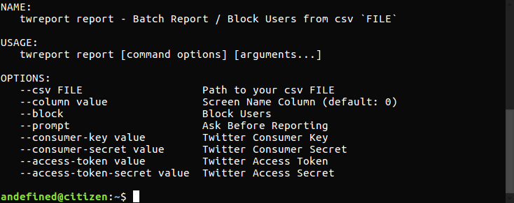

[](https://travis-ci.org/andefined/twreport)
[](https://goreportcard.com/report/github.com/andefined/twreport)
[](https://goreportcard.com/report/github.com/andefined/twreport/releases/latest)
[](https://codecov.io/gh/andefined/twreport/releases/latest)

[](https://github.com/andefined/twreport)

# twreport
A simple CLI for batch reporting / blocking abusive accounts on Twitter.

## Installation
You can download the binaries from the [releases](/releases) section, or you can install it with Go.

```bash
go get -u github.com/andefined/twreport
go install github.com/andefined/twreport
```

## How to use
1. Prepare you *csv* file without a header. Just point the correct column of the *screen_name* with `--column` flag. Default column is *0*.

    e.g. CSV `874276197357596672,realDonaldTrump`
2. Create an [application](https://apps.twitter.com) and generate *Access Token and Token Secret* under *Keys and Access Tokens* tab.


```bash
twreport report \
    --consumer-key $CONSUMER-KEY \
    --consumer-secret $CONSUMER-SECRET \
    --access-token $ACCESS-TOKEN \
    --access-token-secret $ACCESS-TOKEN-SECRET \
    --csv ./templates/block.csv \
    --column 1 \
    --prompt \
    --block
```
